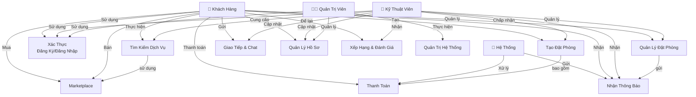
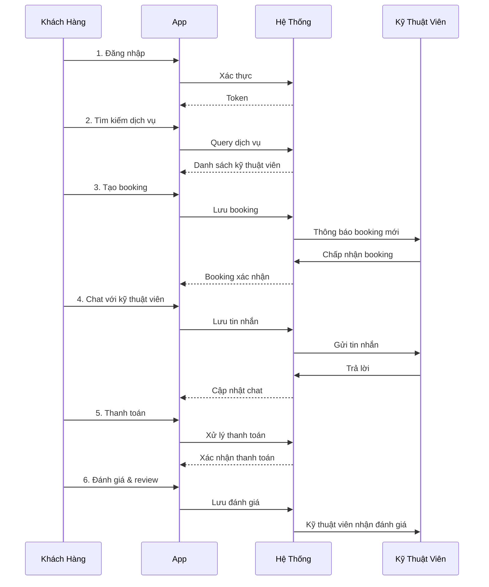

# Sơ Đồ Use Case Tổng Quát - Fixit Vietnam

Sơ đồ này hiển thị các trường hợp sử dụng chính của hệ thống Fixit ở cấp độ tổng quát.

## Sơ Đồ Use Case Tổng Quát

## Các Trường Hợp Sử Dụng Chính

### 1. 🔐 Xác Thực (Authentication)
**Diễn viên**: Khách hàng, Kỹ thuật viên, Quản trị viên

**Mô tả**: Người dùng đăng ký tài khoản mới hoặc đăng nhập vào hệ thống

**Quy trình**:
- Nhập email/số điện thoại và mật khẩu
- Hoặc sử dụng Google Sign-In
- Hệ thống xác thực và cấp quyền truy cập
- Lưu session/token

---

### 2. 🔍 Tìm Kiếm Dịch Vụ (Search Services)
**Diễn viên**: Khách hàng, Kỹ thuật viên

**Mô tả**: Khách hàng tìm kiếm dịch vụ sửa chữa phù hợp

**Quy trình**:
- Nhập loại sửa chữa (ví dụ: sửa màn hình)
- Lọc theo vị trí, giá cả, xếp hạng
- Xem danh sách kỹ thuật viên
- Xem chi tiết dịch vụ

---

### 3. 📅 Tạo Đặt Phòng (Create Booking)
**Diễn viên**: Khách hàng, Kỹ thuật viên

**Mô tả**: Khách hàng tạo yêu cầu sửa chữa, kỹ thuật viên chấp nhận

**Quy trình**:
- Khách hàng chọn dịch vụ và kỹ thuật viên
- Chọn ngày giờ sửa chữa
- Xác định địa điểm
- Kỹ thuật viên nhận thông báo và chấp nhận/từ chối
- **Kết quả**: Booking được xác nhận

---

### 4. 📊 Quản Lý Đặt Phòng (Manage Booking)
**Diễn viên**: Khách hàng, Kỹ thuật viên

**Mô tả**: Theo dõi và cập nhật trạng thái đặt phòng

**Quy trình**:
- Xem danh sách booking (sắp tới, đang diễn hành, hoàn thành)
- Cập nhật trạng thái (chờ, đang sửa, hoàn thành)
- Hủy booking nếu cần
- Xem chi tiết từng booking

---

### 5. 💬 Giao Tiếp & Chat (Communication)
**Diễn viên**: Khách hàng, Kỹ thuật viên

**Mô tả**: Hai bên liên lạc về chi tiết dịch vụ

**Quy trình**:
- Gửi tin nhắn trực tiếp
- Chia sẻ vị trí trên bản đồ
- Chia sẻ ảnh/video
- Chat history được lưu

---

### 6. 💳 Thanh Toán (Payment)
**Diễn viên**: Khách hàng, Hệ thống thanh toán

**Mô tả**: Xử lý thanh toán cho dịch vụ

**Quy trình**:
- Xem giá dịch vụ
- Chọn phương thức thanh toán (thẻ, ví, chuyển khoản)
- Nhập thông tin thanh toán
- Hệ thống xử lý với payment gateway
- Ghi nhận giao dịch

---

### 7. 👤 Quản Lý Hồ Sơ (Manage Profile)
**Diễn viên**: Khách hàng, Kỹ thuật viên, Quản trị viên

**Mô tả**: Cập nhật thông tin cá nhân

**Quy trình**:
- Xem hồ sơ hiện tại
- Chỉnh sửa tên, email, số điện thoại
- Upload ảnh đại diện
- Cập nhật địa chỉ, kỹ năng (với kỹ thuật viên)
- Lưu thay đổi

---

### 8. ⭐ Xếp Hạng & Đánh Giá (Rating & Review)
**Diễn viên**: Khách hàng, Kỹ thuật viên

**Mô tả**: Đánh giá chất lượng dịch vụ sau booking hoàn thành

**Quy trình**:
- Sau khi booking xong, khách hàng được nhắc đánh giá
- Chọn số sao (1-5)
- Viết bình luận chi tiết
- Gửi đánh giá
- Kỹ thuật viên nhận đánh giá, có thể trả lời

---

### 9. 🛠️ Quản Trị Hệ Thống (Admin Management)
**Diễn viên**: Quản trị viên

**Mô tả**: Quản lý toàn bộ hệ thống

**Quy trình**:
- Xem/quản lý người dùng
- Xem tất cả booking
- Xem thống kê & báo cáo
- Xử lý tranh chấp
- Reset mật khẩu người dùng
- Xóa tài khoản nếu cần

---

### 10. 🔔 Nhận Thông Báo (Notifications)
**Diễn viên**: Hệ thống, Khách hàng, Kỹ thuật viên

**Mô tả**: Gửi thông báo quan trọng cho người dùng

**Quy trình**:
- Booking được tạo/chấp nhận
- Kỹ thuật viên sắp đến
- Thanh toán hoàn thành
- Đánh giá mới
- Tin nhắn mới
- **Phương thức**: Push notification, Email, SMS

---

### 11. 🛒 Marketplace (Marketplace)
**Diễn viên**: Khách hàng

**Mô tả**: Mua/bán linh kiện, công cụ sửa chữa

**Quy trình**:
- Duyệt sản phẩm
- Lọc theo danh mục/giá
- Xem chi tiết sản phẩm
- Thêm vào giỏ hàng
- Thanh toán
- Theo dõi đơn hàng

---

## Sơ Đồ Tương Tác

## Tóm Tắt

| Trường Hợp | Vai Trò Chính | Kết Quả Chính |
|-----------|--------------|--------------|
| Xác Thực | Người dùng | Đăng nhập thành công |
| Tìm Kiếm | Khách hàng | Tìm thấy kỹ thuật viên |
| Đặt Phòng | Khách hàng/Kỹ thuật viên | Booking xác nhận |
| Quản Lý | Khách hàng/Kỹ thuật viên | Cập nhật trạng thái |
| Chat | Khách hàng/Kỹ thuật viên | Giao tiếp thành công |
| Thanh Toán | Khách hàng | Thanh toán hoàn thành |
| Hồ Sơ | Người dùng | Cập nhật thông tin |
| Đánh Giá | Khách hàng | Feedback được ghi nhận |
| Quản Trị | Admin | Hệ thống được giám sát |
| Thông Báo | Hệ thống | Người dùng nhận thông tin |
| Marketplace | Khách hàng | Mua/bán sản phẩm |

## Giá Trị Chính

✅ **Cho Khách Hàng**:
- Tìm kỹ thuật viên tin cậy
- Đặt lịch dễ dàng
- Thanh toán an toàn
- Đánh giá minh bạch

✅ **Cho Kỹ Thuật Viên**:
- Nhận booking từ khách hàng
- Quản lý lịch làm việc
- Nhận đánh giá/xếp hạng
- Quản lý doanh thu

✅ **Cho Quản Trị Viên**:
- Giám sát toàn hệ thống
- Quản lý người dùng
- Xem thống kê & báo cáo
- Xử lý tranh chấp
