# Sơ Đồ Ranh Giới Hệ Thống - Fixit Vietnam

Sơ đồ này hiển thị toàn bộ hệ thống Fixit, các thành phần ngoài, và cách chúng tương tác với nhau.

## Sơ Đồ Ranh Giới Hệ Thống

```mermaid
graph TB
    subgraph EXTERNAL["🌐 Hệ Thống Ngoài"]
        GOOGLE["Google Services"]
        PAYMENT["Hệ Thống Thanh Toán<br/>Stripe/PayPal"]
        EMAIL["Email Service"]
        SMS["SMS Gateway"]
    end

    subgraph FIXIT["🏢 Hệ Thống FIXIT"]
        MOBILE["📱 Ứng Dụng Mobile<br/>Flutter App"]
        
        subgraph BACKEND["⚙️ Backend Services"]
            AUTH["Authentication<br/>Service"]
            BOOKING["Booking<br/>Service"]
            PAYMENT_SRV["Payment<br/>Service"]
            CHAT["Chat<br/>Service"]
            NOTIFICATION["Notification<br/>Service"]
            PROFILE["Profile<br/>Service"]
            MARKETPLACE["Marketplace<br/>Service"]
            ADMIN["Admin<br/>Service"]
        end
        
        subgraph DATABASE["💾 Cơ Sở Dữ Liệu"]
            USERS_DB["User Data"]
            BOOKING_DB["Booking Data"]
            CHAT_DB["Chat Messages"]
            MARKETPLACE_DB["Marketplace Items"]
            TRANSACTION_DB["Transactions"]
        end
        
        subgraph STORAGE["📦 Lưu Trữ"]
            FILE_STORAGE["File Storage<br/>Images, Videos"]
            REALTIME["Realtime DB<br/>Live Updates"]
        end
    end

    subgraph USERS["👥 Người Dùng"]
        CUSTOMER["👤 Khách Hàng"]
        TECHNICIAN["🔧 Kỹ Thuật Viên"]
        ADMIN_USER["👨‍💼 Quản Trị Viên"]
    end

    %% User to Mobile App
    CUSTOMER -->|Sử dụng| MOBILE
    TECHNICIAN -->|Sử dụng| MOBILE
    ADMIN_USER -->|Quản lý qua| MOBILE

    %% Mobile App to Backend Services
    MOBILE -->|Đăng ký/Đăng nhập| AUTH
    MOBILE -->|Tạo/Quản lý đặt phòng| BOOKING
    MOBILE -->|Thanh toán| PAYMENT_SRV
    MOBILE -->|Gửi/nhận tin nhắn| CHAT
    MOBILE -->|Nhận thông báo| NOTIFICATION
    MOBILE -->|Cập nhật hồ sơ| PROFILE
    MOBILE -->|Mua/bán hàng| MARKETPLACE
    MOBILE -->|Quản trị hệ thống| ADMIN

    %% Backend to Database
    AUTH -->|Lưu/đọc| USERS_DB
    BOOKING -->|Lưu/đọc| BOOKING_DB
    CHAT -->|Lưu/đọc| CHAT_DB
    MARKETPLACE -->|Lưu/đọc| MARKETPLACE_DB
    PAYMENT_SRV -->|Lưu/đọc| TRANSACTION_DB
    PROFILE -->|Lưu/đọc| USERS_DB

    %% Backend to Storage
    MOBILE -->|Upload/download| FILE_STORAGE
    CHAT -->|Real-time| REALTIME
    BOOKING -->|Real-time| REALTIME
    NOTIFICATION -->|Real-time| REALTIME

    %% Backend to External Services
    AUTH -->|OAuth 2.0| GOOGLE
    PAYMENT_SRV -->|API| PAYMENT
    NOTIFICATION -->|Gửi email| EMAIL
    NOTIFICATION -->|Gửi SMS| SMS

    %% External Services Feedback
    GOOGLE -.->|Trả về token| AUTH
    PAYMENT -.->|Trả về kết quả| PAYMENT_SRV
    EMAIL -.->|Xác nhận| NOTIFICATION
    SMS -.->|Xác nhận| NOTIFICATION
```



## Mô Tả Chi Tiết

### 1. Người Dùng (Users)
| Vai Trò | Mô Tả |
|--------|-------|
| **Khách Hàng** | Người tìm kiếm dịch vụ sửa chữa |
| **Kỹ Thuật Viên** | Nhà cung cấp dịch vụ sửa chữa |
| **Quản Trị Viên** | Quản lý nền tảng, người dùng, và dữ liệu |

### 2. Ứng Dụng Mobile (Frontend)
- **Công nghệ**: Flutter (Dart)
- **Chức năng chính**:
  - Giao diện người dùng
  - Điều hướng (GoRouter)
  - Quản lý trạng thái (Riverpod)
  - Xử lý realtime
  - Hiển thị bản đồ (Google Maps)

### 3. Backend Services (Appwrite)

| Dịch Vụ | Chức Năng |
|---------|-----------|
| **Authentication** | Xác thực người dùng, OAuth, quản lý phiên |
| **Booking** | Tạo, quản lý, theo dõi đặt phòng |
| **Payment** | Xử lý thanh toán, quản lý ví tiền |
| **Chat** | Nhắn tin realtime giữa các bên |
| **Notification** | Thông báo push, email, SMS |
| **Profile** | Quản lý hồ sơ người dùng |
| **Marketplace** | Mua bán linh kiện, công cụ sửa chữa |
| **Admin** | Quản lý người dùng, phân tích dữ liệu |

### 4. Cơ Sở Dữ Liệu (Appwrite Database)

| Bảng | Dữ Liệu Lưu Trữ |
|-----|-----------------|
| **Users_DB** | Thông tin người dùng, hồ sơ, xếp hạng |
| **Booking_DB** | Chi tiết đặt phòng, lịch sử, trạng thái |
| **Chat_DB** | Tin nhắn, hội thoại |
| **Marketplace_DB** | Sản phẩm, giá, kho |
| **Transactions_DB** | Lịch sử thanh toán, ví tiền |

### 5. Lưu Trữ (Storage)

| Loại | Mục Đích |
|------|----------|
| **File Storage** | Ảnh đại diện, ảnh dịch vụ, video hướng dẫn |
| **Realtime DB** | Cập nhật live cho chat, đặt phòng, thông báo |

### 6. Hệ Thống Ngoài (External Systems)

| Hệ Thống | Tích Hợp | Chức Năng |
|---------|---------|----------|
| **Google Services** | OAuth 2.0, Google Sign-In, Google Maps | Xác thực, định vị, bản đồ |
| **Payment Gateway** | Stripe / PayPal API | Xử lý thanh toán |
| **Email Service** | SMTP API | Gửi email xác thực, thông báo |
| **SMS Gateway** | Twilio / Vonage | Gửi SMS xác thực, thông báo |

## Luồng Dữ Liệu Chính

### 1. Đăng Ký & Đăng Nhập
```
Khách Hàng → Mobile App → Auth Service → Google/OAuth 
           → Users DB → Mobile App → Khách Hàng
```

### 2. Tạo Đặt Phòng
```
Khách Hàng → Mobile App → Booking Service → Booking DB
           → Notification Service → Email/SMS → Khách Hàng & Kỹ Thuật Viên
```

### 3. Thanh Toán
```
Khách Hàng → Mobile App → Payment Service → Payment Gateway
           → Transactions DB → Mobile App → Khách Hàng (Xác nhận)
```

### 4. Chat Realtime
```
Khách Hàng → Mobile App → Chat Service → Realtime DB
           → Kỹ Thuật Viên → Mobile App → Kỹ Thuật Viên
```

### 5. Quản Lý Hệ Thống
```
Quản Trị Viên → Mobile App → Admin Service → Users DB / Booking DB
              → Quản Trị Viên
```

## Tương Tác Hệ Thống

### Bảo Mật
- ✅ OAuth 2.0 cho xác thực ngoài
- ✅ JWT tokens cho mobile app
- ✅ Appwrite Security Rules cho database
- ✅ HTTPS/TLS cho tất cả API calls

### Khả Năng Mở Rộng
- 📊 Microservices architecture trên Appwrite
- ⚡ Realtime database cho cập nhật live
- 🔄 Background jobs cho thanh toán/notification
- 📦 Cloud storage cho media

### Đáng Tin Cậy
- 🔄 Retry mechanism cho API calls
- 💾 Data replication trong Appwrite
- 📈 Monitoring và logging
- 🔐 Backup & disaster recovery

## Công Nghệ Sử Dụng

### Frontend
- Flutter + Dart
- Riverpod (State Management)
- GoRouter (Navigation)

### Backend
- Appwrite (BaaS)
- Google Cloud Services
- Payment Gateways
- Notification Services

### Infrastructure
- Cloud Hosting (Appwrite Cloud)
- CDN cho file storage
- Message queues cho notification
